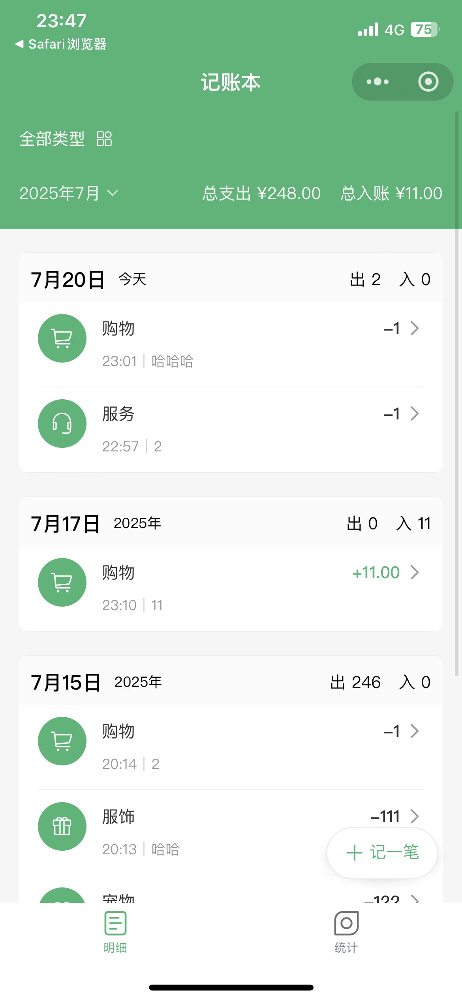
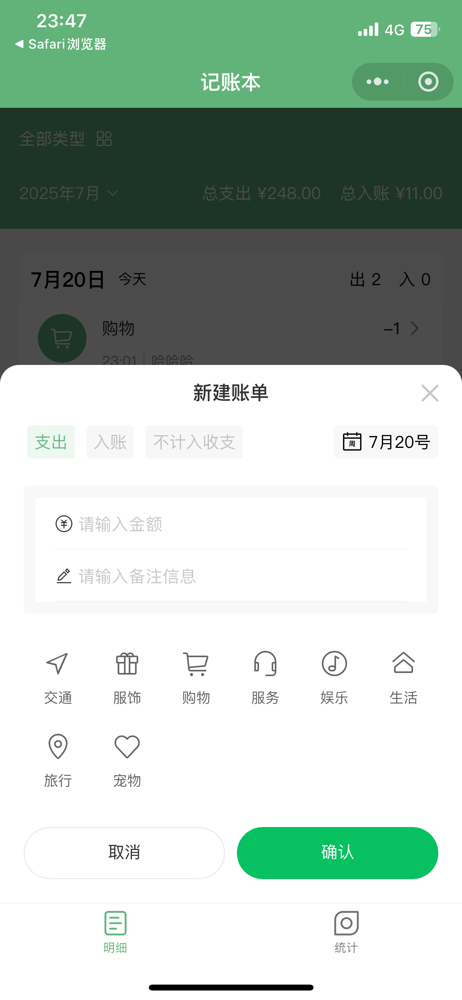
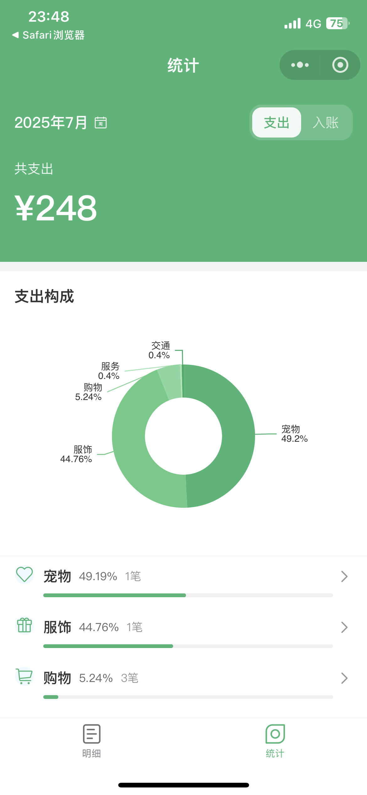

# ledger-life

使用 AI 编程开发的记账小程序 A note-taking mini-program developed with AI coding.

|       首页账单列表       | 添加/编辑账单界面        | 统计分析页面             |
| :----------------------: | :----------------------- | :----------------------- |
|  |  |  |

AI 编程社区&交流：https://pd.qq.com/s/4pte5xsw1


## 主要功能

- 账单的新增、编辑、删除、查询
- 支持收入/支出分类
- 账单统计与可视化（如月度对比、分类占比等）
- 云端数据存储，数据安全可靠
- 响应式 UI，适配多种设备
- ...

## 技术栈

- 微信小程序（Weixin Mini Program）
- 云开发 CloudBase（云函数、云数据库）
- Vant Weapp UI 组件库
- JavaScript

## 目录结构

```
ledger-life/
├── cloudfunctions/      # 云函数目录
│   ├── bill/            # 账单相关云函数
│   ├── common/          # 公共云函数
│   └── user/            # 用户相关云函数
├── miniprogram/         # 小程序主目录
│   ├── components/      # 复用组件
│   ├── images/          # 图片资源
│   ├── pages/           # 页面目录
│   ├── utils/           # 工具函数
│   └── miniprogram_npm/ # npm 依赖
├── project.config.json  # 小程序项目配置
└── README.md            # 项目说明
```

## 快速开始

1. **安装依赖**
   - 在微信开发者工具中打开本项目，自动安装 npm 依赖。
2. **配置云开发环境**
   - 在微信开发者工具中开通云开发，绑定环境。
   - 确保数据库集合（如 bills）已创建并设置好权限。
3. **本地开发与调试**
   - 直接在微信开发者工具中预览、调试。
4. **部署云函数**
   - 右键 cloudfunctions 目录，选择“上传并部署：所有云函数”。

## 贡献指南

欢迎提交 issue 或 pull request 参与项目改进。

1. Fork 本仓库
2. 新建分支进行开发
3. 提交 PR 并描述你的更改内容

## 参考文档

- [微信小程序官方文档](https://developers.weixin.qq.com/miniprogram/dev/framework/)
- [云开发文档](https://developers.weixin.qq.com/miniprogram/dev/wxcloud/basis/getting-started.html)
- [Vant Weapp 组件库](https://youzan.github.io/vant-weapp/)
